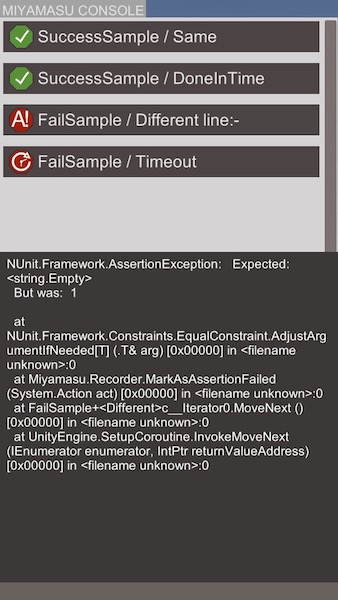

# Miyamasu

Make asynchronous tests on Device easy.  
for Unity 5.6 or later.

## Motivation
Running Unity Tests on Devices and show results.
Also running Unity Tests on Editor.

## How to start

1. Open Window > Test Runner > click PlayMode button.
1. click Create PlayMode test button.
1. Restart Unity once.
1. Open **/Assets/SampleScene.unity**
1. All sample tests will run automatically when play.(for Player)
1. or, click RunAll button on Test Runner window.(for Editor)

## Install to other project
Open "MiyamasuTestRunner.unitypackage" in this repo.

## Settings
Unity > Window > Miyamasu Test Runner > Open Settings

## Future
* run on UnityCloudBuild.
* device tests orchestration.
* send failed test logs to Slack.
* accept command from Slack.

## License
see below.  
[LICENSE](./LICENSE)
